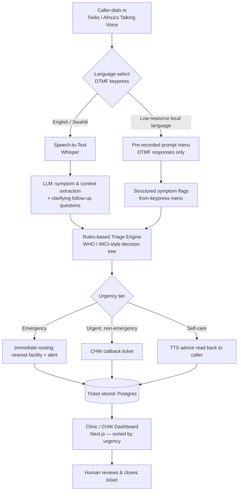

# A Voice-First Medical Intake & Routing Agent

> A phone-call-based AI agent that intakes patient symptoms over voice, applies structured triage logic, and routes the caller (like a support ticket) to the right resource — self-care advice, a community health worker (CHW) callback, the nearest clinic, or emergency referral.

**This is a triage/routing system, not a diagnostic tool.** The AI's role is limited to natural-language symptom extraction and conversation; the actual urgency decision is made by an inspectable, rules-based decision tree, and every ticket is closed by a human at a clinic or CHW level.

---

## 1. Problem Statement

Sub-Saharan Africa carries a disproportionate share of global disease burden relative to its clinical workforce. Africa has 2.3 healthcare workers per 1,000 population, compared with 24.8 per 1,000 in the Americas — only 1.3% of the world's health workers serve a population carrying 25% of the global disease burden [1]. WHO's regional modelling projects a needs-based shortage of 6.1 million health workers across the WHO African Region by 2030, with current supply covering less than half of projected need [2][3]. WHO's Regional Director for Africa has linked this shortage directly to the difficulty of tackling maternal and infant mortality, infectious disease, and even basic services like vaccination [4].

At the same time, mobile phone access — specifically voice, not smartphone data — is the most universal digital channel available on the continent. Sub-Saharan Africa's mobile subscriber penetration sits around 44–52%, still well below the global average of 66%, and feature phones (not smartphones) have historically made up the majority of the region's device base [5][6]. A voice-call interface requires no app install, no data plan, no literacy, and works on the cheapest handset in circulation — which smartphone-app-based health tools structurally exclude.

## 2. Research Gap

Existing digital-health interventions in the region cluster into two categories, and both leave a gap this project targets:

1. **Rigid IVR/USSD systems** (e.g., "press 1 for fever, press 2 for cough") — accessible on any phone, but brittle: they can't handle a caller describing multiple, vague, or compound symptoms in natural speech, and they don't adapt follow-up questions to what the caller has already said.
2. **Smartphone-app symptom checkers** — capable of natural free-text/voice input and LLM-driven follow-up, but implicitly require a smartphone, a data connection, and app literacy — excluding a large share of the population with the highest unmet need (older adults, rural callers, feature-phone users).

**The gap:** there is no widely deployed system that combines (a) the accessibility of a plain voice call on any handset with (b) LLM-driven natural conversation for symptom extraction, while (c) keeping the actual medical urgency decision in a transparent, auditable rules engine rather than an opaque model — a design constraint that matters for both clinical safety and regulatory trust. Precedent exists for AI-assisted decision support multiplying scarce clinical capacity [7], but not, to our knowledge, as a voice-call-native, multi-language, ticket-routing layer built for feature-phone reach.

This project's contribution is that specific combination: **voice-native accessibility + LLM conversation + rules-based safety layer + human-closed ticketing loop**, with an explicit fallback path for low-resource local languages (see §5).

## 3. System Architecture

**Design principle:** the LLM sits only in the *conversation and extraction* layer (boxes C, E). It never outputs the final urgency tier directly — that's computed by the deterministic rules engine (box G), which is inspectable, testable, and defensible in front of both judges and, eventually, a real health authority.

### Components

| Layer | Tool | Role |
|---|---|---|
| Voice gateway | Twilio Voice or Africa's Talking Voice API | Answers calls, plays prompts, captures speech/DTMF |
| Speech-to-text | Whisper (or provider STT) | Converts caller speech to text (English/Swahili path only) |
| Conversation/extraction | LLM (Claude/GPT via API) | Extracts symptoms, duration, severity; asks 1–2 clarifying questions |
| Local-language path | Pre-recorded native-speaker audio + DTMF | Structured menu bypassing ASR/TTS gaps (see §5) |
| Triage logic | Hardcoded rules engine (Python/Django) | WHO/IMCI-style decision tree → urgency tier |
| Text-to-speech | TTS provider or pre-generated clips | Reads back next steps to the caller |
| Backend / data store | Django + PostgreSQL | Stores each call as a "ticket": symptoms, tier, status |
| Dashboard | Next.js/React | Clinic/CHW view of open tickets, sorted by urgency |

## 4. Data Flow (per call)

1. Caller dials in → selects language via keypress.
2. **English/Swahili:** free speech → Whisper transcription → LLM extracts symptoms + asks follow-up if needed.
   **Local language:** caller hears pre-recorded symptom prompts → responds via keypress.
3. Structured symptom data passed to the rules engine → urgency tier assigned (Emergency / Urgent / Self-care).
4. Ticket created in Postgres with caller number, symptoms, tier, timestamp, status = "open."
5. Emergency/Urgent tickets trigger a routing action (nearest facility lookup + CHW alert); Self-care tickets get a spoken advice message.
6. Dashboard updates in real time; a human at the clinic/CHW level reviews and closes the ticket.

## 5. Local-Language Handling Strategy

- **English/Swahili:** full LLM pipeline (free speech understood), since STT/TTS coverage is reasonably reliable for these.
- **Other local languages (e.g., Luganda, Runyankole):** ASR/TTS quality is unreliable for these languages, so the system falls back to a **pre-recorded audio menu + DTMF keypress** — no live transcription or synthesis required. A native speaker records ~15–20 short symptom prompts ahead of time; the same rules engine processes the keypress responses.
- This is a deliberate architectural choice, not a limitation to hide: it means **adding a new language only requires recording a prompt set**, not retraining or sourcing a new ASR/TTS model — which is the realistic path to genuine multi-language coverage in this domain today.

## 6. Safety & Scope Notes

- The system never states a diagnosis. Output is limited to an urgency tier and a routing action.
- The rules engine (not the LLM) makes the urgency call, so the logic can be reviewed, tested, and audited independently of model behavior.
- Every ticket is closed by a human — the system augments, not replaces, the CHW/clinic decision.

## 7. References

[1] Shortage of healthcare workers in developing countries — Africa. PubMed. https://pubmed.ncbi.nlm.nih.gov/19484878/

[2] Ballpark Estimates of Budget Space for Health Workforce Investments in the 47 Countries of the WHO African Region: A Modelling Study. PMC. https://pmc.ncbi.nlm.nih.gov/articles/PMC11830165/

[3] Projected health workforce requirements and shortage for addressing the disease burden in the WHO Africa Region, 2022–2030: a needs-based modelling study. BMJ Global Health. https://www.ncbi.nlm.nih.gov/pmc/articles/PMC11789529/

[4] Chronic staff shortfalls stifle Africa's health systems: WHO study. WHO Regional Office for Africa. https://www.afro.who.int/news/chronic-staff-shortfalls-stifle-africas-health-systems-who-study

[5] The Mobile Economy — Sub-Saharan Africa. GSMA Intelligence. https://www.gsma.com/mobileeconomy/wp-content/uploads/2020/03/GSMA_MobileEconomy2020_SSA_Eng.pdf

[6] Feature phones and the renewed drive for internet penetration in Africa. Techpoint Africa. https://techpoint.africa/insight/drive-for-feature-phone-penetration-in-africa/

[7] Addressing Africa's healthcare worker shortage. MamaOpe. https://mamaope.com/news/healthcare-worker-shortage-addressing/

---

## 8. Next Steps / Build Order

- [ ] Stand up Django + Postgres ticket schema
- [ ] Wire Twilio/Africa's Talking sandbox voice number
- [ ] Build rules-engine decision tree (WHO/IMCI symptom set)
- [ ] Wire Whisper STT + LLM extraction for English/Swahili path
- [ ] Record local-language prompt set + build DTMF menu path
- [ ] Build Next.js dashboard (ticket list, urgency sort, status update)
- [ ] End-to-end demo run: live call → ticket → dashboard update
